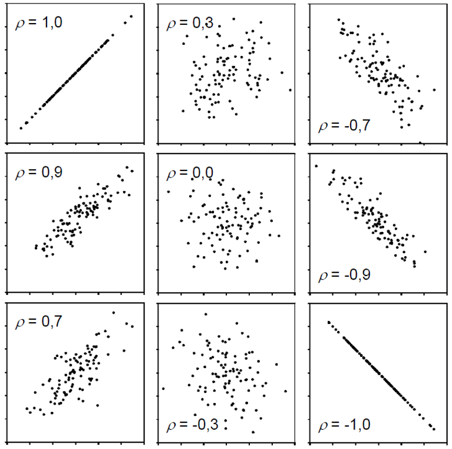

```{r setup, include=FALSE}
knitr::opts_chunk$set(echo = TRUE,
                      warning = FALSE,
                      message = FALSE)
```

This chapter is trying to give you a feeling for what correlation and (simple linear) regression is. I am aware that the example data doesn't have anything to do with agriculture or related fields, but I decided to keep it because it allows for an intuitive conclusion at the end.
 
```{r}
# packages
pacman::p_load(tidyverse) # data import and handling
```

# Data

This is data I made up: Peter and Max went out multiple evenings and at the end of every evening wrote down how many drinks they had and what the alcohol content in their blood was.

## Import

```{r}
# data (import via URL)
dataURL <- "https://raw.githubusercontent.com/SchmidtPaul/DSFAIR/master/data/DrinksPeterMax.csv"
dat <- read_csv(dataURL)

dat
```

## Goal

The goal of this analysis is to answer the question how the number of drinks relates to the blood alcohol level. Note that we will completely ignore the column `Person`, since we do not care whether data came from Peter or Max in this chapter. Thus, we only focus on the two *numeric* columns `drinks` and `blood_alc`.

## Exploring

To quickly get a first feeling for this dataset, we can use `summary()` and draw a `plot()`:

```{r, out.width = '80%', fig.align='center'}
summary(dat)
plot(y = dat$blood_alc, x = dat$drinks)
```

Apparently, the number of drinks ranges from 1 to 9 with a mean of 3.85, while the measured blood alcohol levels range from 0.1 to 1.3 with a mean of 0.515. The plot shows a clear trend of increasing blood alcohol levels with a higher number of drinks - which is what we would expect.

# Correlation

## What is it?

One way of actually putting a number on this relationship we can deduce visually in the plot is to estimate the correlation. When people talk about correlation ($\rho$ or $r$) in statistics, they usually refer to the [Pearson correlation coefficient](https://www.wikiwand.com/en/Pearson_correlation_coefficient), which is a measure of linear correlation between two numeric variables. Correlation can only have values between -1 and 1, where 0 means _no correlation_, while all other possible values are either negative or positive correlations. The farther away from 0, the stronger is the correlation. 

```{r pressure, echo=FALSE, out.width = '60%', fig.align='center'}

```

Simply put, a positive correlation means _"if one variable gets bigger, the other also gets bigger"_ and a negative correlation means _"if one variable gets bigger, the other gets smaller"_. Therefore, it does not matter which of the two variables is the first ("x") or the second ("y") variable. Thus, a correlation estimate is not like a model and it cannot make predictions. Finally, [*"correlation does not imply causation"*](https://www.wikiwand.com/en/Correlation_does_not_imply_causation) means that just because you found a (strong) correlation between two things, you cannot conclude that there is a cause-and-effect relationship between the two, which becomes clear when looking at [these examples](https://www.tylervigen.com/spurious-correlations).


